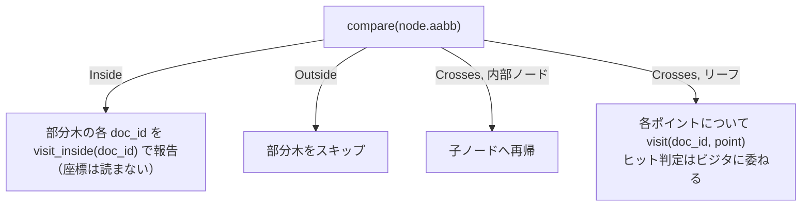

# BKD-Tree

Laurus は数値・日時・地理ポイントなどのデータを **BKD-Tree** (Block KD-Tree)
に格納する。BKD-Tree はディスク常駐の多次元インデックスで、レンジ・バウンディング
ボックス・距離・k 近傍 (k-NN) の各クエリを単一のファイル形式で扱える。

「空間的な形」を持つあらゆるフィールド型はこの BKD プリミティブを共有する：

| フィールド型 | 次元数 | 座標空間 |
| :--- | :---: | :--- |
| `Integer` / `Float`（単一値・多値） | 1 | スカラー |
| `DateTime` | 1 | Unix マイクロ秒（UTC） |
| `Geo`（単一値・多値） | 2 | 緯度・経度（度） |
| `Geo3d`（単一値・多値） | 3 | ECEF 直交座標（メートル） |

新しい空間フィールド型を追加する作業は、次元数を選んでクエリ側の
[`IntersectVisitor`](#intersectvisitor-プロトコル) を書くだけに帰着する。
ライタ・リーダ・オンディスクレイアウトはそのまま再利用される。

## ファイルフォーマット (Version 4)

`.bkd` セグメントファイルは自己完結型のバイナリで、3 つの領域から成る：

```text
+----------------------------------------+
| File Header                            |   固定長・バージョンタグ付き
+----------------------------------------+
| Leaf Blocks                            |   bit-packed points + doc_ids
|   leaf 0                               |
|   leaf 1                               |
|   ...                                  |
+----------------------------------------+
| Index Nodes                            |   内部ナビゲーションノード
|   node N-1                             |
|   ...                                  |
|   node 0  (root, written last)         |
+----------------------------------------+
```

ヘッダ (`BKDFileHeader`) は `magic`、`version`（現在は `4`）、`num_dims`、
`bytes_per_dim`、総ポイント数、リーフブロック数、`block_size`
（writerが設定したリーフあたりの最大ポイント数。読み込み時にリーフの
`count` を検証する上限として使う、Issue #1142）、**全体の軸ごと
min/max**、インデックス領域とルートノードへのオフセットを保持する。

### Leaf Block レイアウト

各リーフブロックは、その部分木に属するポイントを bit-pack して格納する
（Issue #549、以前は生の `f64`/`u64` だった）。Issue #1142以降は、
再帰的な構築が残す空間分割順ではなく**doc_id昇順**で格納される：

```text
count               u32               — リーフ内のポイント数
leaf_min            [f64; num_dims]   — リーフレベルの AABB 下端
leaf_max            [f64; num_dims]   — リーフレベルの AABB 上端
doc_id_base         u64               — リーフ内の doc_id の最小値
doc_id_bits         u8                — 連続するdoc_id差分の最大値のbit幅
packed_dim[0]       バイト整列        — `sortable(point) - sortable(leaf_min[d])` をbit-pack
packed_dim[1..]     ...               — 次元ごとに1セクション
packed_doc_ids      バイト整列        — 連続差分をbit-pack（後述）
```

各次元のbit幅は、`leaf_min[d]`/`leaf_max[d]` を（`f64::total_cmp` と同じ
IEEE 754 の全順序を保つ）`u64` に写像した値から**導出**され、ディスクには
保存しない。書き込み側と読み込み側が同じ式で計算するため、両者がずれる
心配がない。リーフ全体で定数の次元は幅0bitに導出され、1バイトも消費しない。

`packed_doc_ids` は`doc_id_base`からの独立差分ではなく**連続差分**を
格納する: 値`i`は`doc_id[i-1] + delta`（`doc_id[-1] := doc_id_base`）
であり、先頭のdeltaは常に`0`になる（読み込み側は先頭deltaが非ゼロの
場合を破損として拒否する）。したがって`doc_id_bits`は
`bits_needed(max-min)`ではなく`bits_needed(連続差分の最大値)`となり、
連続差分の合計は常にリーフの`max-min`と等しくなる（テレスコーピング和）
ため理論上これより大きくなることはなく、doc_idがリーフの全範囲に
均等に広がっているのではなく局所的に密集している場合に大幅に小さく
なりうる。`doc_id_bits`だけは唯一ディスクに保存される幅で（`doc_id`側
には導出元となる「最大値」ヘッダフィールドが無いため）、読み込み時に
`64` を超える値は破損として拒否する。doc_idによるソートは**安定
ソート**であり、同一doc_idを持つ複数の点（多値の数値・地理フィールド）は元の
相対順序を保つ — これは`GeoBoxPointsVisitor`の「最初に見つかった点が
勝つ」という重複排除方式が依存している性質である。

削減率はデータの相関度に依存する。旧v2形式（生のリーフフォーマット）に
対する比率は、一様乱数の1次元/2次元/3次元データでおよそ2.16倍/1.67倍/
1.50倍、単調増加するフィールド（タイムスタンプや自動採番カウンタなど）
では2.66倍程度 — v3（Issue #1142以前）の1.96倍/1.59倍/1.45倍/2.28倍
から改善している。これは、連続差分によるdoc_id符号化が、単一アンカー
からの独立差分では捉えられなかった局所的なdoc_idの密集を活用できる
ためである。これは量子化ではなく可逆な差分符号化方式であり、`±0.0` や
`±Infinity` を含め全てのポイントがビット完全に往復する。

リーフごとに AABB を持たせることで、クエリ領域がリーフの外側にある場合
(`Outside`) や全内包される場合 (`Inside`) には、ポイントを1つもデコードせずに
リーフ全体を判定できる。`Inside` の場合はpacked pointセクションを1回の
シークでスキップし、`doc_ids` のみをデコードする。

### 内部 Index Node レイアウト

内部ノードは分割情報に加え、子ごとの AABB も保持する：

```text
split_dim           u32                       — 分割する軸
split_value         f64                       — 分割しきい値
left_min            [f64; num_dims]           — 左部分木の AABB 下端
left_max            [f64; num_dims]           — 左部分木の AABB 上端
right_min           [f64; num_dims]           — 右部分木の AABB 下端
right_max           [f64; num_dims]           — 右部分木の AABB 上端
left_offset         u64                       — 左子ノードのファイルオフセット
right_offset        u64                       — 右子ノードのファイルオフセット
```

> ノードごとの AABB（v2 で追加）は、分割値だけを持っていた v1 レイアウトを
> 置き換える。これにより `Inside` / `Outside` の枝刈りが、再帰的な
> 探索ではなく定数時間の矩形判定で済むようになった。

## ビルドアルゴリズム

`BKDWriter::write` は、平坦な row-major のポイントバッファと並列の `doc_ids`
バッファからツリーを構築する。構築は **最も広い軸で分割する (widest-axis
split)** ヒューリスティクスで進む：

1. 入力部分集合の AABB を計算する。
2. `(max - min)` レンジが最も広い軸を選ぶ（同点時は次元番号の小さい方を
   採用して決定的にする）。
3. インデックスの並びをその軸でソートし、中央値で分割する。
4. 部分木が `block_size`（既定 `512`）以下のポイント数になるまで再帰し、
   そうなったらリーフとして書き出す。
5. 子が flush された後、各親の `left_offset` / `right_offset` を後埋めする。

ビルダはポイント／doc_id バッファ自体ではなく**インデックスの並び**
（permutation）をソートするため、ポイント数に関わらずポイント単位の
ヒープ確保を一切おこなわない。

### 数値ロバスト性

座標は全順序で比較できる必要がある。`BKDWriter::write` は `NaN` を明示的に
拒否する。`NaN` には順序が定義されておらず、分割判定とノードごとの AABB
不変条件を破壊するためである。`±INFINITY` は両方とも受理され、クエリでは
「無限大」を表す自然なセンチネルとして機能する。

## IntersectVisitor プロトコル

BKD インデックスへのクエリは
[`IntersectVisitor`](https://github.com/mosuka/laurus/blob/main/laurus/src/lexical/index/structures/visitor.rs)
の実装として表現する。リーダはツリーを辿りながら、ビジタに 3 種類の
情報を尋ねる：

```rust
pub enum CellRelation {
    Inside,   // 部分木全体がヒット — ポイント単位の照合不要
    Outside,  // 部分木全体をスキップできる
    Crosses,  // 再帰、もしくはリーフをポイント単位で照合
}

pub trait IntersectVisitor {
    fn compare(&self, cell: &AABB) -> CellRelation;
    fn visit_inside(&mut self, doc_id: u64);
    fn visit(&mut self, doc_id: u64, point: &[f64]);
}
```

リーダのトラバーサルは次のように進む：



この 3 値分類こそが枝刈りを実現する鍵である。常に `Crosses` を返すビジタを
書いても結果は正しい — 単にリーフ全件走査に退化するだけだ。

### レンジクエリ

レガシーの `BKDTree::range_search` API は `intersect` の薄いラッパに
なっている。`RangeQueryVisitor` を半開区間／閉区間のパラメータから組み立て、
無限大の `None` スロットを `±INFINITY` に変換する。境界の包含・排他は
ビジタ自身が処理する。

### 3D 地理クエリ

3 つのビジタが [`laurus::lexical::query::geo3d`](geo3d.md) に存在し、
`Geo3d` (3D ECEF) フィールドをターゲットにする：

| クエリ | `compare` の判定領域 | `visit` の点ごとの判定 |
| :--- | :--- | :--- |
| `Geo3dDistanceQuery` | 球 `(centre, radius)` と AABB | ユークリッド距離 ≤ radius |
| `Geo3dBoundingBoxQuery` | クエリ AABB と セル AABB | 点がクエリ AABB に内包 |
| `Geo3dNearestQuery` (k-NN) | クエリ点を中心に拡大していく球 | 距離 ≤ 現在の k 番目最良値 |

同じプリミティブで将来のあらゆる空間クエリ（ポリゴンクエリや 2D `Geo`
の大円距離クエリなど）を新しいビジタとして実装できる。

## リーダの内部実装

`BKDReader::intersect` は 1 クエリにつき 1 つのスクラッチバッファ
(`IntersectScratch`) を使う。バッファは出会った最大のリーフサイズまで
拡大されたあと、後続のリーフでも再利用される。結果として、何枚のリーフを
辿っても、1 クエリの間にアロケータに触れる回数はごく少数で済む。

単一リーフだけのツリー（非常に小さなフィールド）は特別扱いされる：
「ルートオフセット」がそのまま唯一のリーフを指すため、内部ノードの
降下処理は完全にスキップされる。

## 関連項目

- [3D 地理検索 (ECEF)](geo3d.md) — ECEF 距離・バウンディング
  ボックス・k-NN を実装した具体的な BKD ベースのビジタ。
- [Lexical インデクシング](indexing/lexical_indexing.md) — `.bkd`
  セグメントファイルがセグメント全体のレイアウト内のどこに位置するか。
- [Lexical 検索](search/lexical_search.md) — `NumericRangeQuery`、
  `GeoDistanceQuery` / `GeoBoundingBoxQuery`、`Geo3dDistanceQuery` の Rust API エントリポイント。
