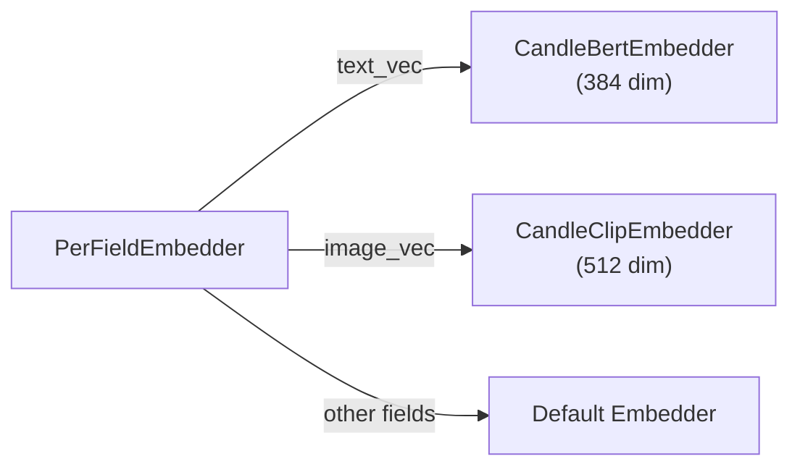

# Embedding

Embedding は、テキスト（または画像）を意味的な情報を捉えた密なベクトル（数値ベクトル）に変換します。類似した意味を持つ 2 つのテキストは、ベクトル空間内で近い位置のベクトルを生成するため、類似度ベースの検索が可能になります。

## Embedder トレイト

すべての Embedder は `Embedder` トレイトを実装します。

```rust
#[async_trait]
pub trait Embedder: Send + Sync + Debug {
    async fn embed(&self, input: &EmbedInput<'_>) -> Result<Vector>;
    async fn embed_batch(&self, inputs: &[EmbedInput<'_>]) -> Result<Vec<Vector>>;
    fn supported_input_types(&self) -> Vec<EmbedInputType>;
    fn name(&self) -> &str;
    fn as_any(&self) -> &dyn Any;
}
```

`embed()` メソッドは `Vector`（`Vec<f32>` をラップした構造体）を返します。

`EmbedInput` は 2 つのモダリティをサポートします。

| バリアント | 説明 |
| :--- | :--- |
| `EmbedInput::Text(&str)` | テキスト入力 |
| `EmbedInput::Bytes(&[u8], Option<&str>)` | バイナリ入力（オプションの MIME タイプ付き、画像用） |

### トークン単位の Embedder

ColBERT のような late interaction のモデルは、入力全体で 1 本ではなく、
トークンごとに 1 本のベクトルを出し、クエリと文書を異なる方法で符号化します。
このような Embedder は `TokenEmbedder` も実装し、`Embedder::as_token_embedder`
で自分自身を返します（Issue #1349）。

```rust
#[async_trait]
pub trait TokenEmbedder: Send + Sync + Debug {
    async fn embed_tokens(&self, inputs: &[EmbedInput<'_>], role: EmbedRole)
        -> Result<Vec<Vec<Vector>>>;
    fn token_dimension(&self) -> usize;
}

pub enum EmbedRole { Query, Document }
```

[MultiVector フィールド](schema_and_fields.md#multivector-フィールド)は、テキストを
この trait でだけ埋め込みます。この trait を持たない Embedder（1 入力 1 本の
ベクトルを出すモデル）は、1 トークンだけの文書を黙って作るのではなく、
エラーになります。

## 組み込み Embedder

### CandleBertEmbedder

Hugging Face Candle を使用して BERT モデルをローカルで実行します。API キーは不要です。

**Feature flag:** `embeddings-candle`

```rust
use laurus::CandleBertEmbedder;

// Downloads model on first run (~80MB)
let embedder = CandleBertEmbedder::new(
    "sentence-transformers/all-MiniLM-L6-v2"  // model name
)?;
// Output: 384-dimensional vector
```

| プロパティ | 値 |
| :--- | :--- |
| モデル | `sentence-transformers/all-MiniLM-L6-v2` |
| 次元数 | 384 |
| 実行環境 | ローカル（CPU） |
| 初回ダウンロード | 約 80 MB |

sentence-transformers と同じ方法で符号化し、`all-MiniLM-L6-v2` と
`paraphrase-multilingual-MiniLM-L12-v2` では、出力のベクトルが
sentence-transformers と要素ごとに 1e-6 以内で一致します。

- 入力は、`sentence_bert_config.json` にあるモデルの `max_seq_length`
  （`all-MiniLM-L6-v2` は 256 トークン、`paraphrase-multilingual-MiniLM-L12-v2` は 128）
  で切り詰めます。特殊トークンも長さに含みます。このファイルがないリポジトリでは、
  `tokenizer.json` の切り詰めの長さ、それもなければモデルの `max_position_embeddings`
  を使います。`tokenizer.json` の padding の設定は使いません。
- ベクトルは、トークンのベクトルの平均を L2 正規化したものです。sentence-transformers
  では正規化しないモデル（`paraphrase-multilingual-MiniLM-L12-v2` など）や、別の方法で
  pooling するモデルでも、同じようにこの処理を行います。

`CandleBertEmbedder::with_options(model, CandleBertOptions::default().revision("<commit>"))`
で、モデルをコミットに固定できます。

> **マイグレーション注記（Issue #1340）:** 以前の版は attention mask を token type id
> としてモデルに渡し、すべての入力を `tokenizer.json` の長さまで PAD で埋めていたため、
> ベクトルがずれていました（`all-MiniLM-L6-v2` では、短い文で sentence-transformers との
> cosine が 0.61〜0.70 しかありませんでした）。`candle_bert` のベクトルは変わり、長い入力は
> `all-MiniLM-L6-v2` で 128 ではなく `max_seq_length` トークンまで使うようになりました。
> `candle_bert` で作った索引は埋め込み直してください。そうしないと、新しいクエリの
> ベクトルが古い文書のベクトルと比べられます。
>
> **マイグレーション注記（Issue #1355）:** 以前の版は、ダウンロードしたモデルを
> hf-hub 本来のデフォルトである `~/.cache/huggingface/hub/models--*` ではなく
> `~/.cache/huggingface/models--*` にキャッシュしており、`HF_HUB_CACHE`・
> `XDG_CACHE_HOME` も無視していました。モデルは今後 hf-hub 本来のデフォルトの
> 場所にダウンロードされ、Python の `huggingface_hub` ライブラリとキャッシュを
> 共有します。古いパスに残っている既存のダウンロードは再利用されないため、
> 削除してかまいません。

### OpenAIEmbedder

OpenAI Embeddings API を呼び出します。API キーが必要です。

**Feature flag:** `embeddings-openai`

```rust
use laurus::OpenAIEmbedder;

let embedder = OpenAIEmbedder::new(
    api_key,
    "text-embedding-3-small".to_string()
).await?;
// Output: 1536-dimensional vector
```

| プロパティ | 値 |
| :--- | :--- |
| モデル | `text-embedding-3-small`（または任意の OpenAI モデル） |
| 次元数 | 1536（text-embedding-3-small の場合） |
| 実行環境 | リモート API 呼び出し |
| 必要条件 | `OPENAI_API_KEY` 環境変数 |

### CandleClipEmbedder

マルチモーダル（テキスト + 画像）Embedding のために CLIP モデルをローカルで実行します。

**Feature flag:** `embeddings-multimodal`

```rust
use laurus::CandleClipEmbedder;

let embedder = CandleClipEmbedder::new(
    "openai/clip-vit-base-patch32"
)?;
// Text or images → 512-dimensional vector
```

| プロパティ | 値 |
| :--- | :--- |
| モデル | `openai/clip-vit-base-patch32` |
| 次元数 | 512 |
| 入力タイプ | テキストおよび画像 |
| ユースケース | テキストから画像への検索、画像から画像への検索 |

> **マイグレーション注記（Issue #1355）:** 以前の版は、ダウンロードしたモデルを
> hf-hub 本来のデフォルトである `~/.cache/huggingface/hub/models--*` ではなく
> `~/.cache/huggingface/models--*` にキャッシュしており、`HF_HUB_CACHE`・
> `XDG_CACHE_HOME` も無視していました。モデルは今後 hf-hub 本来のデフォルトの
> 場所にダウンロードされ、Python の `huggingface_hub` ライブラリとキャッシュを
> 共有します。古いパスに残っている既存のダウンロードは再利用されないため、
> 削除してかまいません。

### CandleColbertEmbedder

BERT ベースの ColBERT のチェックポイントをローカルで実行し、トークンごとに
1 本のベクトルを出します。MultiVector フィールドに対する
[late interaction による再採点](search/vector_search.md#late-interaction-による再採点rescore)
に使います。トークン単位の Embedder 専用で、`embed()` はエラーを返します。

**Feature flag:** `embeddings-candle`

```rust
use laurus::{CandleColbertEmbedder, CandleColbertOptions};

// Uses the checkpoint's own settings (artifact.metadata).
let embedder = CandleColbertEmbedder::new("colbert-ir/colbertv2.0")?;

// Pin the model commit and override the lengths.
let embedder = CandleColbertEmbedder::with_options(
    "answerdotai/answerai-colbert-small-v1",
    CandleColbertOptions::default()
        .revision("934fa8bb4ce2284f4c2baa232d81aca4d076fa5e")
        .doc_maxlen(300),
)?;
```

| プロパティ | `colbert-ir/colbertv2.0` | `answerdotai/answerai-colbert-small-v1` |
| :--- | :--- | :--- |
| トークンベクトルの次元数 | 128 | 96 |
| クエリの長さ（`query_maxlen`） | 32 | 32 |
| 文書の長さ（`doc_maxlen`） | 180 | 300 |
| ライセンス | MIT | Apache-2.0 |
| 実行環境 | ローカル（CPU） | ローカル（CPU） |

参照実装の colbert-ai と同じ方法で符号化します。

```text
query:    [CLS] [unused0] w1 … wn [SEP] [MASK] … [MASK]   exactly query_maxlen tokens
document: [CLS] [unused1] w1 … wn [SEP]                   at most doc_maxlen tokens
```

- クエリの `[MASK]` による埋め草には attention を向けませんが、そのベクトルは
  残します。クエリを拡張する役割を持つためです。
- 文書では、句読点のトークンのベクトルを取り除きます。
- どのベクトルも、チェックポイントの `linear` 層で射影してから L2 正規化します。

長さ、マーカー、これらの切り替えは、チェックポイントの `artifact.metadata`
から読みます（ファイルがない場合は colbert-ai の既定値の 32 と 220）。
`CandleColbertOptions` で長さを上書きできます。上の 2 つのチェックポイントでは、
出力のベクトルが colbert-ai と要素ごとに 1e-6 以内で一致します。

推論は CPU 上のブロッキングタスクで、最大 32 件ずつのバッチで行います。
目安として、Apple M4 ではクエリ 1 件が `colbertv2.0` で約 55 ms、
`answerai-colbert-small-v1` で約 18 ms、約 110 トークンの文書 1 件が約 135 ms と
約 45 ms です。

`revision` はコミットに固定してください。write-ahead log はまだコミットされて
いない文書のテキストを保持し、復旧時に埋め込み直すため、モデルが変わると
異なるベクトルになります。対応するのは BERT ベースのチェックポイントだけです
（`lightonai/GTE-ModernColBERT-v1` のような ModernBERT ベースのものは対象外）。

### PrecomputedEmbedder

Embedding 計算を行わず、事前計算済みのベクトルを直接使用します。ベクトルが外部で生成される場合に便利です。

```rust
use laurus::PrecomputedEmbedder;

let embedder = PrecomputedEmbedder::new();  // no parameters needed
```

`PrecomputedEmbedder` を使用する場合、ドキュメントには Embedding 用のテキストではなく、ベクトルを直接指定します。

```rust
let doc = Document::builder()
    .add_vector("embedding", vec![0.1, 0.2, 0.3, ...])
    .build();
```

## PerFieldEmbedder

`PerFieldEmbedder` は Embedding リクエストをフィールド固有の Embedder にルーティングします。



```rust
use std::sync::Arc;
use laurus::PerFieldEmbedder;

let bert = Arc::new(CandleBertEmbedder::new("...")?);
let clip = Arc::new(CandleClipEmbedder::new("...")?);


let per_field = PerFieldEmbedder::new(bert.clone());
per_field.add_embedder("text_vec", bert.clone());
per_field.add_embedder("image_vec", clip.clone());

let engine = Engine::builder(storage, schema)
    .embedder(Arc::new(per_field))
    .build()
    .await?;
```

これは以下の場合に特に有用です。

- 異なる Vector フィールドに異なるモデルが必要な場合（例: テキスト用に BERT、画像用に CLIP）
- 異なるフィールドが異なるベクトル次元を持つ場合
- ローカル Embedder とリモート Embedder を混在させたい場合

## Embedding の使用方法

### インデクシング時

Vector フィールドにテキスト値を追加すると、Engine が自動的に Embedding を生成します。

```rust
let doc = Document::builder()
    .add_text("text_vec", "Rust is a systems programming language")
    .build();
engine.add_document("doc-1", doc).await?;
// The embedder converts the text to a vector before indexing
```

トークン単位の Embedder を持つ MultiVector フィールドも、同じようにテキストを
受け付けます。テキストは文書として、トークンごとに 1 本のベクトルへ埋め込まれます。

### 検索時

テキストで検索すると、Engine がクエリテキストも同様に Embedding 化します。

```rust
// Builder API
let request = VectorSearchRequestBuilder::new()
    .add_text("text_vec", "systems programming")
    .build();

// Query DSL
let request = vector_parser.parse(r#"text_vec:"systems programming""#).await?;
```

どちらのアプローチも、インデクシング時と同じ Embedder を使用してクエリテキストを Embedding 化するため、一貫したベクトル空間が保証されます。

late interaction による再採点も、クエリをテキストで受け取れます
（`RescoreOptions::late_interaction_text`）。MultiVector フィールドのトークン単位の
Embedder が、それをクエリとして埋め込みます。

## Feature Flag まとめ

各 Embedder は `Cargo.toml` で特定の Feature Flag を有効にする必要があります。

| Embedder | Feature Flag | 依存関係 |
| :--- | :--- | :--- |
| `CandleBertEmbedder` | `embeddings-candle` | candle-core, candle-nn, candle-transformers, hf-hub, tokenizers |
| `CandleColbertEmbedder` | `embeddings-candle` | `CandleBertEmbedder` と同じ |
| `OpenAIEmbedder` | `embeddings-openai` | reqwest |
| `CandleClipEmbedder` | `embeddings-multimodal` | image + embeddings-candle |
| `PrecomputedEmbedder` | *（なし -- 常に利用可能）* | -- |

`embeddings-all` Feature ですべての Embedding 機能を一括で有効にできます。詳細は [Feature Flags](../development/feature_flags.md) を参照してください。

## Embedder の選択

| シナリオ | 推奨 Embedder |
| :--- | :--- |
| クイックプロトタイピング、オフライン利用 | `CandleBertEmbedder` |
| 高精度が求められる本番環境 | `OpenAIEmbedder` |
| テキスト + 画像検索 | `CandleClipEmbedder` |
| late interaction による再採点（MultiVector フィールド） | `CandleColbertEmbedder` |
| 外部パイプラインからの事前計算済みベクトル | `PrecomputedEmbedder` |
| フィールドごとに複数モデルを使用 | 他の Embedder をラップした `PerFieldEmbedder` |
