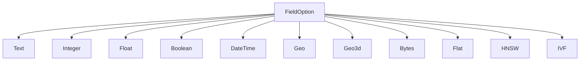
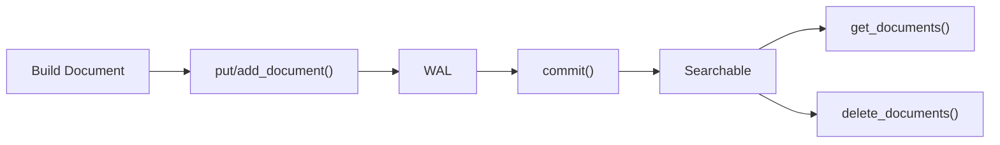

# スキーマとフィールド

`Schema` はドキュメントの構造を定義します。どのフィールドが存在し、各フィールドがどのようにインデクシングされるかを指定します。Schema は Engine にとって唯一の情報源です。

> CLI で使用される TOML ファイル形式については、[スキーマフォーマットリファレンス](../laurus-cli/schema_format.md)を参照してください。

## Schema

`Schema` は名前付きフィールドのコレクションです。各フィールドは**Lexical フィールド**（キーワード検索用）または **Vector フィールド**（類似度検索用）のいずれかです。

```rust
use laurus::Schema;
use laurus::lexical::TextOption;
use laurus::lexical::core::field::IntegerOption;
use laurus::vector::HnswOption;

let schema = Schema::builder()
    .add_text_field("title", TextOption::default())
    .add_text_field("body", TextOption::default())
    .add_integer_field("year", IntegerOption::default())
    .add_hnsw_field("embedding", HnswOption::default())
    .add_default_field("body")
    .build();
```

### デフォルトフィールド

`add_default_field()` は、クエリがフィールド名を明示的に指定しない場合に検索対象となるフィールドを指定します。これは [Query DSL](../concepts/query_dsl.md) パーサーで使用されます。

## フィールドタイプ



### Lexical フィールド

Lexical フィールドは転置インデックス（Inverted Index）を使用してインデクシングされ、キーワードベースのクエリをサポートします。

| タイプ | Rust 型 | SchemaBuilder メソッド | 説明 |
| :--- | :--- | :--- | :--- |
| **Text** | `TextOption` | `add_text_field()` | 全文検索可能。Analyzer によりトークン化される |
| **Integer** | `IntegerOption` | `add_integer_field()` | 64 ビット符号付き整数。範囲クエリをサポート |
| **Float** | `FloatOption` | `add_float_field()` | 64 ビット浮動小数点数。範囲クエリをサポート |
| **Boolean** | `BooleanOption` | `add_boolean_field()` | `true` / `false` |
| **DateTime** | `DateTimeOption` | `add_datetime_field()` | UTC タイムスタンプ。範囲クエリをサポート |
| **Geo** | `GeoOption` | `add_geo_field()` | 緯度/経度のペア。半径検索とバウンディングボックスクエリをサポート |
| **Geo3d** | `Geo3dOption` | `add_geo3d_field()` | 3D ECEF 直交座標ポイント（`x`, `y`, `z`、メートル）。3D 距離検索・バウンディングボックス・k-NN クエリをサポート。詳細は [3D 地理検索](geo3d.md) を参照 |
| **Bytes** | `BytesOption` | `add_bytes_field()` | バイナリデータ |

#### Text フィールドオプション

`TextOption` はテキストのインデクシング方法を制御します。

```rust
use laurus::lexical::TextOption;

// Default: indexed + stored + term vectors + doc values (all true)
let opt = TextOption::default();

// Customize
let opt = TextOption::default()
    .indexed(true)
    .stored(true)
    .multi_valued(false)
    .position_increment_gap(100)
    .term_vectors(true)
    .doc_values(true);
```

| オプション | デフォルト | 説明 |
| :--- | :--- | :--- |
| `indexed` | `true` | フィールドが検索可能かどうか |
| `stored` | `true` | 元の値が取得用に保存されるかどうか |
| `multi_valued` | `false` | 文字列の配列を受け付けるかどうか（Issue #1175）。term クエリは**いずれかの要素**がタームを含めばマッチ。詳細は後述の「多値（multi-valued）フィールド」を参照 |
| `position_increment_gap` | `100` | 多値フィールドの要素間で読み飛ばす位置数（Lucene の `positionIncrementGap`）。slop がこの値に達しない限り、フレーズクエリが 2 つの要素をまたぐことはない。`0` にすると要素を連結したものとして位置を付番する。`multi_valued` が `true` でなければ無視される |
| `term_vectors` | `true` | ターム位置が保存されるかどうか（フレーズクエリ・スパンクエリで使用。ハイライトは常に保存済みテキストを再トークナイズするため使用しない） |
| `doc_values` | `true` | 値を DocValues（[ソート](../laurus/faceting.md)・ファセット・集計が読み取る列指向ストア）にもコピーするかどうか |

`doc_values` は `TextOption` 専用ではありません。`BytesOption` を除く全ての lexical
フィールドオプション（`IntegerOption`, `FloatOption`, `BooleanOption`, `DateTimeOption`,
`GeoOption`, `Geo3dOption`）が同じ設定を持ちます。`BytesOption` にはこの設定がありません
――  `Bytes` の値はソートにもファセットにも使えないため、設定にかかわらず DocValues には
一切書き込まれないからです。実効ルールは次のとおりです: DocValues 列が書き込まれるのは
`stored` と `doc_values` の両方が `true`（かつ値の型が `Bytes` でない）場合のみです。
ソートにもファセットにも使わないフィールドで `doc_values: false` を設定すると、二重目の
コピーを省略できるため、セグメントの使用容量が削減されます。

### Vector フィールド

Vector フィールドは近似最近傍（ANN: Approximate Nearest Neighbor）検索のためのベクトルインデックスを使用してインデクシングされます。

| タイプ | Rust 型 | SchemaBuilder メソッド | 説明 |
| :--- | :--- | :--- | :--- |
| **Flat** | `FlatOption` | `add_flat_field()` | ブルートフォース線形スキャン。正確な結果 |
| **HNSW** | `HnswOption` | `add_hnsw_field()` | Hierarchical Navigable Small World グラフ。高速な近似検索 |
| **IVF** | `IvfOption` | `add_ivf_field()` | Inverted File Index。クラスタベースの近似検索 |

#### HNSW フィールドオプション（最も一般的）

```rust
use laurus::vector::HnswOption;
use laurus::vector::core::distance::DistanceMetric;
use laurus::vector::core::quantization::QuantizationMethod;

let opt = HnswOption {
    dimension: 384,                                  // vector dimensions
    distance: DistanceMetric::Cosine,                // distance metric
    m: 16,                                           // max connections per layer
    ef_construction: 200,                            // construction search width
    default_ef_search: Some(100),                    // schema-level ef_search default (issue #644)
    base_weight: 1.0,                                // 他の vector フィールドに対する相対的な優先度（issue #1084）
    quantizer: QuantizationMethod::Scalar8Bit,       // 必須（デフォルト Scalar8Bit）
    embedder: None,                                  // 任意の embedder 名
};
```

#### `default_ef_search`: 検索時の recall 調整パラメータ

`ef_search` はクエリ時の動的候補リストのサイズを制御するパラメータです（`ef_construction` がインデックス**ビルド時**にだけ影響するのとは別物です）。値を大きくするほどグラフ近傍の探索範囲が広がり、レイテンシと引き換えに recall が上がります。

- **スキーマレベルのデフォルト**: `HnswOption.default_ef_search = Some(ef)` でフィールドごとのデフォルトを引き上げられます。`None` の場合、サーチャは内部 fallback (`50`) を使用します。
- **クエリごとのオーバーライド**: 検索リクエスト側で [`SearchRequestBuilder::vector_ef_search`](../laurus.md) を指定すると、スキーマデフォルトより優先されます。
- **自動引き上げ**: いずれの経路で `ef_search` を指定した場合でも、サーチャは少なくとも `top_k`（`rerank_factor` 併用時は `top_k * rerank_factor`）まで持ち上げるため、`top_k` 要求に対して候補ヒープが不足することはありません。
- Issue [#644](https://github.com/mosuka/laurus/issues/644) で対応。

パラメータの詳細なガイダンスについては、[Vector インデクシング](indexing/vector_indexing.md)を参照してください。

## Document

`Document` は名前付きフィールド値のコレクションです。`DocumentBuilder` を使用してドキュメントを構築します。

```rust
use laurus::Document;

let doc = Document::builder()
    .add_text("title", "Introduction to Rust")
    .add_text("body", "Rust is a systems programming language.")
    .add_integer("year", 2024)
    .add_float("rating", 4.8)
    .add_boolean("published", true)
    .build();
```

### ドキュメントのインデクシング

`Engine` はドキュメントを追加するための 2 つのメソッドを提供しており、それぞれ異なるセマンティクスを持ちます。

| メソッド | 動作 | ユースケース |
| :--- | :--- | :--- |
| `put_document(id, doc)` | **Upsert** — 同じ ID のドキュメントが存在する場合、置き換えられる | 標準的なドキュメントインデクシング |
| `add_document(id, doc)` | **Append** — 新しいチャンクとしてドキュメントを追加。同じ ID で複数のチャンクを持てる | チャンク分割されたドキュメント（例: 段落に分割された長い記事） |

```rust
// Upsert: replaces any existing document with id "doc1"
engine.put_document("doc1", doc).await?;

// Append: adds another chunk under the same id "doc1"
engine.add_document("doc1", chunk2).await?;

// Always commit after indexing
engine.commit().await?;
```

### ドキュメントの取得

`get_documents` を使用して、外部 ID でドキュメント（チャンクを含む）を取得します。

```rust
let docs = engine.get_documents("doc1").await?;
for doc in &docs {
    if let Some(title) = doc.get("title") {
        println!("Title: {:?}", title);
    }
}
```

### ドキュメントの削除

外部 ID を共有するすべてのドキュメントとチャンクを削除します。

```rust
engine.delete_documents("doc1").await?;
engine.commit().await?;
```

### ドキュメントのライフサイクル



> **重要:** ドキュメントは `commit()` が呼び出されるまで検索可能になりません。

### DocumentBuilder メソッド

| メソッド | 値の型 | 説明 |
| :--- | :--- | :--- |
| `add_text(name, value)` | `String` | テキストフィールドを追加 |
| `add_integer(name, value)` | `i64` | 整数フィールドを追加 |
| `add_float(name, value)` | `f64` | 浮動小数点数フィールドを追加 |
| `add_boolean(name, value)` | `bool` | ブールフィールドを追加 |
| `add_datetime(name, value)` | `DateTime<Utc>` | 日時フィールドを追加 |
| `add_vector(name, value)` | `Vec<f32>` | 事前計算済みベクトルフィールドを追加 |
| `add_geo(name, lat, lon)` | `(f64, f64)` | 2D 地理座標フィールドを追加（WGS84） |
| `add_geo_ecef(name, x, y, z)` | `(f64, f64, f64)` | 3D ECEF 直交座標ポイントを追加（メートル） |
| `add_bytes(name, data)` | `Vec<u8>` | バイナリデータを追加 |
| `add_field(name, value)` | `DataValue` | 任意の値型を追加 |

## DataValue

`DataValue` は Laurus におけるフィールド値を表す統合列挙型です。

```rust
pub enum DataValue {
    Null,
    Bool(bool),
    Int64(i64),
    Float64(f64),
    Text(String),
    Bytes(Vec<u8>, Option<String>),  // (data, optional MIME type)
    Vector(Vec<f32>),
    DateTime(DateTime<Utc>),
    Geo(GeoPoint),                   // 2D WGS84 ポイント (latitude, longitude)
    GeoEcef(GeoEcefPoint),           // 3D ECEF 直交座標ポイント (x, y, z)、メートル
    Int64Array(Vec<i64>),            // 多値整数フィールド
    Float64Array(Vec<f64>),          // 多値浮動小数点フィールド
    GeoArray(Vec<GeoPoint>),         // 多値 2D 地理フィールド
    GeoEcefArray(Vec<GeoEcefPoint>), // 多値 3D ECEF フィールド
    DateTimeArray(Vec<DateTime<Utc>>), // 多値日時フィールド
    BoolArray(Vec<bool>),            // 多値ブールフィールド
    TextArray(Vec<String>),          // 多値テキストフィールド
}
```

`DataValue` は一般的な型に対して `From<T>` を実装しているため、`.into()` 変換が使用できます。

```rust
use laurus::DataValue;

let v: DataValue = "hello".into();       // Text
let v: DataValue = 42i64.into();         // Int64
let v: DataValue = 3.14f64.into();       // Float64
let v: DataValue = true.into();          // Bool
let v: DataValue = vec![0.1f32, 0.2].into(); // Vector
```

## 予約フィールド

アンダースコア（`_`）で始まるフィールド名は**すべてエンジンの予約領域**です。
ユーザーコードからそのような名前でフィールドを定義することはできず、
`_` で始まるキーを含むドキュメントは投入時にエラーとなります。

唯一許可される `_` プレフィックス名は、次に説明する `_id` システムフィールドです。

### `_id` — 外部ドキュメント ID

`put_document` / `add_document` に渡された外部ドキュメント ID を格納します。
`KeywordAnalyzer`（完全一致）でインデクシングされ、自動的に挿入されるため
スキーマに追加する必要はありません。

## 動的スキーマ

Laurus はスキーマに宣言されていないフィールドを含むドキュメントも受け付けます。
挙動は Schema に設定する `DynamicFieldPolicy` で制御します:

| ポリシー | 未宣言フィールドに対する挙動 |
| :--- | :--- |
| `Strict` | わかりやすいエラーメッセージで投入を拒否する |
| `Dynamic`（デフォルト） | 値から型を推論してスキーマへ自動追加する |
| `Ignore` | 未宣言フィールドを静かに破棄し、他のフィールドはインデックスする |

Builder でポリシーを設定します:

```rust
use laurus::{DynamicFieldPolicy, Schema};

let schema = Schema::builder()
    .dynamic_field_policy(DynamicFieldPolicy::Dynamic)
    .build();
```

### 型推論ルール（Dynamic ポリシー）

| 投入される値 | 推論されるフィールド型 |
| :--- | :--- |
| `string` | `Text`（転置インデックス、BM25） |
| `integer` | `Integer`（BKD tree） |
| `float` | `Float`（BKD tree） |
| `bool` | `Boolean` |
| 整数の配列（例: `[1, 2, 3]`） | `Integer`（`multi_valued = true`） |
| 浮動小数点を含む数値配列（例: `[1.5, 2.0, 3]`） | `Float`（`multi_valued = true`） |
| 緯度キー（`lat` または `latitude`）と経度キー（`lon`、`lng`、`longitude` のいずれか）を持ち、値が範囲内の object | `Geo` |
| 数値の `x`、`y`、`z` の 3 キーをすべて持つ object（有限値、ECEF メートル単位） | `Geo3d` |
| 地理 object の配列（例: `[{"lat": 35.6, "lon": 139.7}, ...]`） | `Geo`（`multi_valued = true`） |
| `x`/`y`/`z` object の配列 | `Geo3d`（`multi_valued = true`） |
| 全要素が RFC 3339 である文字列の配列（例: `["2024-01-01T00:00:00Z", "2024-06-15T21:00:00+09:00"]`） | `DateTime`（`multi_valued = true`） |
| それ以外の文字列の配列（例: `["rust", "search"]`） | `Text`（`multi_valued = true`） |
| ブール値の配列（例: `[true, false]`） | `Boolean`（`multi_valued = true`） |
| `data` キー（base64 エンコードされた文字列）と任意の `mime` キーを持つ object | `Bytes` 値 |

ベクトルフィールド（`Hnsw` / `Flat` / `Ivf`）は **自動推論の対象外**です。
次元数・距離関数・embedder の設定は値だけからは復元できないため、
スキーマへ明示的に宣言してください。`Bytes` の値は上記の `{data, mime}`
オブジェクト形式から**解析**できるようになりましたが、**未宣言**の
フィールドに `Bytes` の値が来た場合は、ベクトルフィールドと同様に
自動登録されず拒否されます（Bytes フィールドは常に明示的な宣言が
必要です）。なお、同一 object 内で 2D 用キー（`lat` / `lon`）、
3D 用キー（`x` / `y` / `z`）、Bytes 用キー（`data`）のうち複数を
混在させた場合は曖昧と判定してエラーとなります。いずれか一方の
形式のみ使用してください。

### 多値（multi-valued）フィールド

`Integer` と `Float` フィールドは `multi_valued = true` を指定することで、
1 ドキュメントに複数の値を保持できます。範囲クエリは**いずれかの値が条件を満たせばマッチ**
する Lucene 流の挙動で、スコアは constant（マッチ件数による加点なし）です。

`Geo` と `Geo3d` フィールドも同様に `multi_valued = true` を指定できます。
多値地理フィールドの各ポイントは、それぞれ独立したエントリとしてフィールドの
BKD tree（`Geo` は 2 次元、`Geo3d` は 3 次元）に登録されます。そのため距離クエリと
バウンディングボックスクエリ（`Geo3d` では nearest クエリも）は、**いずれかのポイント**が
条件を満たせばドキュメントにマッチします。ドキュメントは 1 回だけ報告され、
スコアは条件を満たすポイントのうち最も近いもの（2D バウンディングボックスクエリでは
ボックス中心に最も近いポイント）で決まります。`Dynamic` ポリシーでは、2D object と
3D object を 1 つの配列に混在させた場合、および数値と object を混在させた場合は
エラーになります。各要素には単一ポイントと同じ範囲検証が適用されます。

`DateTime` フィールドも同様に `multi_valued = true` を指定できます（Issue #1184）。
多値日時フィールドの各時刻（instant）は、それぞれ独立した 1 次元のエントリとして
フィールドの BKD tree に登録されます。そのため `DateTimeRangeQuery`、このフィールドに対する
`NumericRangeQuery`、および `seen_at:[2024-06-01 TO 2024-12-31]` のような DSL の日付範囲は、
**いずれかの時刻**が範囲内にあればドキュメントにマッチします（Lucene 流の "any match"、
スコアは constant でマッチ件数による加点なし）。複数の時刻がマッチしてもドキュメントは
1 回だけ報告され、秒未満の時刻も尊重されます（境界は小数秒としてエンコードされます）。
`Dynamic` ポリシーでは、全要素が RFC 3339 文字列である配列は多値 `DateTime` と推論されます。
ここで日時として認識されるのは RFC 3339 のみで（クエリ DSL が受け付けるオフセットなし・日付のみの形式は
対象外）、RFC 3339 でない要素を含む文字列配列は代わりに多値 `Text` と推論されます（Issue #1175）——
エラーにはなりません。なお非対称性に注意してください:
*単一*の RFC 3339 文字列は従来どおり `Text` と推論されます（既存のテキストフィールドの
挙動を変えないため）が、RFC 3339 文字列の*配列*は多値 `DateTime` と推論されます。
単一値の `DateTime` フィールドが必要な場合はスキーマで明示的に宣言してください。

`Boolean` フィールドも同様に `multi_valued = true` を指定できます（Issue #1180）。
ただし仕組みは他の多値型とは異なり、`Boolean` フィールドは BKD ポイントを持ちません。
多値ブールフィールドの各要素は、それぞれ独立した `"true"` / `"false"` の **term posting**
としてインデックスされます。そのため `TermQuery` や `flags:true` のような DSL の term クエリは、
**いずれかの要素**がクエリの値と等しければドキュメントにマッチします（Lucene 流の "any match"）。
複数の要素が同じ値でも、その term についてドキュメントは 1 回だけ報告されます
（posting はドキュメント・term ごとに集約されます）。`Boolean` フィールドが範囲クエリの対象外である点は
従来どおりです。通常の term posting であるため、要素の重複は Lucene と同じように BM25 スコアに影響します:
`[true, true]` は term frequency 2・フィールド長 2 の posting 1 件になるため、`flags:true` に対して
`[true]` より高くスコアリングされ、`[true, false]` は長さ正規化（length normalization）のため
`[true]` よりわずかに低くスコアリングされます。重複排除は行わず、term クエリの constant スコアリングも
ありません（constant スコアの term クエリは Issue #580 で追跡しています）。
`Dynamic` ポリシーでは、全要素がブール値である JSON 配列（例: `[true, false]`）は多値 `Boolean` と
推論されます。`[true, 1]` のような混在配列は、既存の「配列フィールドは数値のみ」という趣旨のエラーで
拒否されます。スカラーとの非対称性に注意してください: *単一*の `"true"` 文字列は宣言済みの `Boolean`
フィールドに対して `Bool` に変換され、`["true", "false"]` のような文字列*配列*も*宣言済み*の多値 `Boolean`
フィールドに送れば同じ規則で要素ごとにパースされます。しかし*未宣言*のフィールドでは、この配列は `Boolean`
ではなく多値 `Text` と推論されます（Issue #1175）—— ブールとして推論させたい配列には JSON のブール値を使ってください。
既存の `Boolean` フィールドで `multi_valued` を有効にする変更は metadata-only です。無効にする変更は、
フィールドが `stored` なら再インデックス（`Reindex`）が必要で、`stored: false` なら **`Destructive`**
になります —— BKD ベースの型と異なり、再構築の元になるポイントツリーがなく、保存された値しかないためです。

`Text` フィールドも同様に `multi_valued = true` を指定できます（Issue #1175）。あわせて
`position_increment_gap` オプション（デフォルト `100`。Lucene / Elasticsearch と同じ値）が追加されています。
多値テキストフィールドの各要素はフィールドの analyzer でそれぞれ独立に解析され、全要素のトークンは
**1 本の昇順の位置列（position sequence）**に追記されます: 要素 `n + 1` の最初のトークンは、要素 `n` の
最後のトークンから `position_increment_gap` 個後ろの位置に置かれます。gap は要素ごとに加算され、
トークンを 1 つも生成しない要素に対しても加算されます。以下の挙動はすべてこの付番から導かれます:

- `TermQuery`（または `tags:rust` のような DSL の term）は、**いずれかの要素**がタームを含めばドキュメントにマッチします（Lucene 流の "any match"）。
- `PhraseQuery` は、slop が `position_increment_gap` 以上でない限り 2 つの要素をまたぐことができません —— 閾値はちょうど `slop == gap` です。デフォルトの gap では、`["hello world", "foo bar"]` はフレーズ `"world foo"` に slop 0〜99 では**マッチせず**、slop 100 で**マッチします**。スパンクエリ（`SpanNearQuery`）も同じ保護を受けます。
- gap を `0` にすると要素を連結したものとして付番されるため、フレーズは要素境界をまたいでマッチします。gap が「0 から付番し直す」という意味になることはありません。
- 複数の要素にまたがるタームの重複は、他の多値型と同じくヒット数ではなく term frequency（したがって BM25 スコア）を増やします。フィールド長は総トークン数なので、gap 自体が BM25 の長さ正規化（length normalization）を膨らませることはありません。
- フレーズクエリが機能するには位置が保存されている必要があります（`term_vectors: true`。デフォルト）。位置がなければフレーズクエリは何にもマッチせず、これは多値・単一値のどちらのフィールドでも同じです。

多値テキストフィールドのハイライトは要素ごとに行われます —— マッチした要素だけがフラグメントを生成し、
フラグメントが 2 つの要素をまたぐことはありません。詳細は [ハイライト](../laurus/highlighting.md) を参照してください。
`Dynamic` ポリシーでは、全要素が文字列である JSON 配列は、全要素が RFC 3339 としてパースできれば多値 `DateTime`、
そうでなければ多値 `Text` と推論されます（例: `["rust", "search"]`）。*単一*の文字列は従来どおり `Text` と推論され、
日時と判定されることはありません。既存の `Text` フィールドで `multi_valued` を有効にする変更は metadata-only です。
無効にする変更は、フィールドが `stored` なら再インデックス（`Reindex`）が必要で、`stored: false` なら
**`Destructive`** になります —— `Boolean` と同じく、再構築の元になる BKD tree がないためです。
`position_increment_gap` の変更は、フィールドが位置を保存している（`term_vectors: true`）場合に再インデックスが
必要です（`stored` なら `Reindex`、そうでなければ `Destructive`）。既存の posting は古い gap で付番されているためです。
`term_vectors` が `false` なら gap は観測できないため、変更は metadata-only です。

多値フィールドに単一値を送った場合は要素 1 個の配列に自動ラップされます。
逆に単一値フィールドに配列を送ると、暗黙の切り捨てではなくエラーになります
（エラーメッセージは `multi_valued = true` でフィールドを宣言するよう案内します）。
多値地理・多値日時・多値ブール・多値テキストフィールドに空配列を送った場合は受理され、
ポイント・時刻・term を持たないフィールドになります（どの空間クエリ・範囲クエリ・term クエリ・フレーズクエリにもマッチしません）。

多値地理・多値日時・多値ブール・多値テキストの値を含むセグメントは新しい stored-field 型タグを使用するため、
これらの機能より前のビルドでは読み込めません。フォーマットのバージョンは上げていないため、
古いリーダーはデータを誤読するのではなく、明示的なエラーで失敗します。
保存される多値日時はマイクロ秒精度（時刻ごとに 1 つの `i64` Unix マイクロ秒。マイクロ秒未満の桁は
切り捨て）で保持され、単一値の `DateTime` は完全な精度を保ちます。
保存される多値ブールは要素ごとに 1 バイト（ビットパックなし）で書き込まれます。
保存される多値テキストは、要素数に続けて各文字列を長さプレフィックス付きで書き込みます
（本体は単一値のテキストと同じ形式です）。

### 型衝突

**既に宣言されている**フィールドに別の型の値が到着した場合、Laurus は
宣言された型への変換を試みます。変換ルールは以下の通りです:

| 宣言型 | 受け取った値 | 結果 |
| :--- | :--- | :--- |
| `Integer` | `Int64` | そのまま格納 |
| `Integer` | `Float64(3.14)` | **`3` へ切り捨て**（情報損失あり — 下の警告を参照） |
| `Integer` | `Text("42")` | `42` としてパース |
| `Integer` | `Text("abc")` | エラー |
| `Float` | `Int64` | `f64` に拡張 |
| `Float` | `Text("3.14")` | パース |
| `Boolean` | `Int64(0)` / `Int64(1)` | `false` / `true` |
| `Boolean` | `Text("true"/"false")` | 大文字小文字を無視してパース |
| `Text` | 任意のスカラー値 | 文字列化 |
| `Bytes` | `Text(s)` | base64 としてデコード（`s` が不正な base64 ならエラー） |
| `Geo` / `Geo3d` | 対応 variant 以外 | エラー |
| `Geo` / `Geo3d`（単一値） | `GeoArray` / `GeoEcefArray` | エラー（`multi_valued = true` を宣言する） |
| `Geo` / `Geo3d`（`multi_valued = true`） | `GeoArray` / `GeoEcefArray` | そのまま格納 |
| `Geo` / `Geo3d`（`multi_valued = true`） | 対応する単一ポイント | 要素 1 個の配列にラップ |
| `Geo` / `Geo3d`（`multi_valued = true`） | 空の数値配列（`[]`） | 空のポイントリスト |
| `DateTime`（単一値） | `DateTimeArray` | エラー（`multi_valued = true` を宣言する） |
| `DateTime`（`multi_valued = true`） | `DateTimeArray` | そのまま格納 |
| `DateTime`（`multi_valued = true`） | 単一の `DateTime` または RFC 3339 の `Text` | 要素 1 個の配列にラップ |
| `DateTime`（`multi_valued = true`） | 空の数値配列（`[]`） | 空の時刻リスト |
| `DateTime`（`multi_valued = true`） | 上記以外 | エラー |
| `Boolean`（単一値） | `BoolArray` | エラー（`multi_valued = true` を宣言する） |
| `Boolean`（`multi_valued = true`） | `BoolArray` | そのまま格納 |
| `Boolean`（`multi_valued = true`） | 単一の `Bool`、`Int64(0)` / `Int64(1)`、または `Text("true"/"false")` | 要素 1 個の配列にラップ（スカラーと同じ規則） |
| `Boolean`（`multi_valued = true`） | `Int64Array` | 同じ `0` / `1` の規則で要素ごとに変換（`[0, 1]` → `[false, true]`。`[0, 2]` は「0 と 1 のみ受け付ける」エラー） |
| `Boolean`（`multi_valued = true`） | 空の数値配列（`[]`） | 空のブールリスト（どの term クエリにもマッチしない） |
| `Boolean`（`multi_valued = true`） | 上記以外 | エラー |
| `Integer` / `Float`（`multi_valued = true`） | `BoolArray` | 要素ごとに `0` / `1` へ拡張（単一値の `Integer` / `Float` は `multi_valued = true` を案内するエラーで拒否） |
| `Text`（単一値） | `TextArray` | エラー（`multi_valued = true` を宣言する） |
| `Text`（`multi_valued = true`） | `TextArray` | そのまま格納 |
| `Text`（`multi_valued = true`） | 単一の `Text`、`Int64`、`Float64`、`Bool`、または `DateTime` | 文字列化して要素 1 個の配列にラップ（スカラーと同じ規則） |
| `Text`（`multi_valued = true`） | `Int64Array` / `Float64Array` / `BoolArray` / `DateTimeArray` | 要素ごとに文字列化（日時は RFC 3339） |
| `Text`（`multi_valued = true`） | `Null` または空の数値配列（`[]`） | 空の文字列リスト（どの term クエリ・フレーズクエリにもマッチしない） |
| `Text`（`multi_valued = true`） | 上記以外（地理配列・ベクトル・バイト列） | エラー |
| `Integer` / `Float` / `Boolean` / `DateTime`（`multi_valued = true`） | `TextArray` | スカラーの `Text` と同じ規則で要素ごとにパース（`["1", "2"]` → `[1, 2]`。不正な要素はその要素を示すエラー）。単一値の `Integer` / `Float` / `Boolean` / `DateTime` は `multi_valued = true` を案内するエラーで拒否 |
| ベクトル（`Hnsw`/`Flat`/`Ivf`） | `Text` または `Bytes` | フィールドの embedder にそのまま渡す |
| ベクトル（`Hnsw`/`Flat`/`Ivf`） | 数値配列 | 要素ごとに `f32` へキャスト |

変換エラーの扱いはポリシーに依存します:

- `Strict`: ただちにエラーを返す
- `Dynamic`: エラーを返す（安全とみなせる変換はこの層ですべて試し切っている）
- `Ignore`: 該当フィールドのみ破棄し、他のフィールドはインデックスする

> **⚠️ 警告: 静かな情報損失が発生しうる**
>
> いくつかの変換は、エラーを返さずに情報を失います:
>
> - `Integer` フィールドは受け取った `Float` 値を**切り捨てます**
>   （`3.14` → `3`、`-3.9` → `-3`）。投入は成功します
> - `Float` フィールドは `f64` 仮数部に収まらない巨大な整数で精度を失う可能性があります
> - `Text` フィールドはスカラーを文字列化して受け入れます（元の型情報は消えます）
> - `Ignore` は非互換なフィールドを静かに捨てます
>
> データの正確性を優先したい場合は、`DynamicFieldPolicy::Strict`
> を使う（あるいは必要なフィールドをすべて事前に宣言する）ことを推奨します。
> `Dynamic` ポリシーは「ドキュメントを投入できる」ことを「入力データを 1 ビットも失わない」ことより優先します。

### Query DSL と未宣言フィールド

スキーマが確定した後、クエリパーサは `field:value` 句で参照されるフィールドが
すべてスキーマに存在することを検証します。`titl:hello`（`title:hello` の打ち間違い）
のような typo は、結果が無言で空になるのではなく、明確なパースエラーとして返ります。

## 動的フィールド管理

稼働中のエンジンに対して、フィールドの追加・削除・変更を動的に行えます。

### フィールドの追加

`Engine::add_field()` を使用すると、稼働中のエンジンにフィールドを動的に追加できます。

#### Lexical フィールドの追加

```rust,ignore
let updated_schema = engine.add_field(
    "category",
    FieldOption::Text(TextOption::default()),
).await?;
```

#### Vector フィールドの追加

```rust,ignore
let updated_schema = engine.add_field(
    "embedding",
    FieldOption::Flat(FlatOption::default().dimension(384)),
).await?;
```

既存のドキュメントには影響がありません（新しいフィールドの値が存在しないだけです）。

### フィールドの削除

`Engine::delete_field()` を使用すると、稼働中のエンジンからフィールドを動的に削除できます。

```rust,ignore
let updated_schema = engine.delete_field("category").await?;
```

フィールド削除時の動作は以下の通りです。

- スキーマからフィールド定義が削除されます。
- `default_fields` に含まれている場合、そこからも削除されます。
- フィールドに紐づくアナライザーおよびエンベッダーの登録が解除されます。
- 既にインデックスされたデータは物理的に残りますが、スキーマから削除されたフィールドにはアクセスできなくなります。

### フィールドの変更

`Engine::update_field()` を使用すると、既存フィールドの型・オプションを稼働中のエンジンに対して変更できます。

```rust,ignore
let outcome = engine.update_field(
    "title",
    FieldOption::Text(TextOption::default().analyzer("english")),
    UpdateFieldOptions { reindex: true, ..Default::default() },
).await?;
```

変更内容は次の3種類に分類され、`outcome.classification` で確認できます。

- **`MetadataOnly`**（メタデータのみ）: 既存データへの影響がなく、常に適用されます（例: HNSW の `default_ef_search`）。
- **`Reindex`**（再構築が必要）: 保存済みの元データから再構築が可能です（例: text フィールドの `analyzer` 変更、`term_vectors` が有効な text フィールドの `position_increment_gap` 変更、`indexed: false → true`、HNSW の `m`/`ef_construction` 変更）。
- **`Destructive`**（破壊的変更）: 元データから再構築できず、既存データを破棄します（例: ベクトルフィールドの `dimension`/`embedder`/`distance` 変更、`stored: false` フィールドの型変更、`stored: false` な `Boolean` / `Text` フィールドの `multi_valued` を無効にする変更）。

`Reindex` と `Destructive` は、明示的に `UpdateFieldOptions { reindex: true, .. }` を指定しない限り拒否されます（再構築に時間がかかる、あるいはデータを失うため、意図しない実行を防ぐオプトイン方式です）。

`Destructive` な変更を適用すると、対象フィールド名がスキーマの `pending_reindex` に記録されます。これは Solr のように「スキーマとインデックスが静かに食い違う」状態を避けるための可視化機構で、`GetSchema` / `laurus get schema` から確認できます。既存データを失ったフィールドが分かるので、必要に応じてドキュメントの再投入で解消してください。

`UpdateFieldOptions { dry_run: true, .. }` を指定すると、実際には何も適用せずに分類結果だけを確認できます。

### 共通の注意事項

`Engine::builder().persist_schema_with(hook)` でスキーマ永続化フックを設定していれば、
`add_field`/`delete_field`/`update_field` は返却前に自らそのフックを呼び出してスキーマを永続化します
（`laurus-cli` と `laurus-server` はどちらもこのフックで `schema.toml` への書き出しを
行っています）。フックを設定していない場合は、従来どおり返却された `Schema` を
呼び出し側で永続化する必要があります（例: `schema.toml` への書き出し）。

## スキーマ設計のヒント

1. **Lexical フィールドと Vector フィールドを分離する** — フィールドは Lexical か Vector のいずれかであり、両方にはなりません。ハイブリッド検索には、別々のフィールドを作成してください（例: テキスト用に `body`、ベクトル用に `body_vec`）。

2. **完全一致フィールドには `KeywordAnalyzer` を使用する** — カテゴリ、ステータス、タグフィールドは `PerFieldAnalyzer` 経由で `KeywordAnalyzer` を使用し、トークン化を避けてください。

3. **適切なベクトルインデックスを選択する** — ほとんどの場合は HNSW、小規模データセットには Flat、非常に大規模なデータセットには IVF を使用してください。詳細は [Vector インデクシング](indexing/vector_indexing.md)を参照。

4. **デフォルトフィールドを設定する** — Query DSL を使用する場合、デフォルトフィールドを設定することで、ユーザーは `body:hello` の代わりに `hello` と記述できます。

5. **スキーマジェネレータを使用する** — `laurus create schema` を実行して、手書きの代わりにインタラクティブにスキーマ TOML ファイルを構築できます。詳細は [CLI コマンド](../laurus-cli/commands.md#create-schema)を参照。
