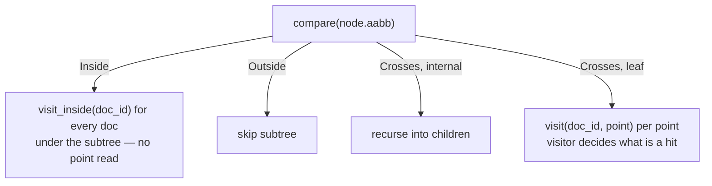

# BKD-Tree

Laurus stores numeric, datetime, and geographic point data in a **BKD-Tree**
(Block KD-Tree) — a disk-resident, multi-dimensional index that supports
range, bounding-box, distance, and k-nearest-neighbour queries on the same
underlying file format.

The BKD primitive is shared by every "spatial-shaped" field type:

| Field type | Dimensions | Coordinate space |
| :--- | :---: | :--- |
| `Integer` / `Float` (single- or multi-valued) | 1 | scalar |
| `DateTime` | 1 | Unix microseconds (UTC) |
| `Geo` (single- or multi-valued) | 2 | latitude / longitude (degrees) |
| `Geo3d` (single- or multi-valued) | 3 | ECEF Cartesian (metres) |

Adding a new spatial field type therefore boils down to picking a
dimensionality and writing a query-side
[`IntersectVisitor`](#query-the-intersectvisitor-protocol) — the writer,
reader, and on-disk layout are reused unchanged.

## File Format (Version 4)

A `.bkd` segment file is a self-contained binary blob made of three regions:

```text
+----------------------------------------+
| File Header                            |   fixed-size, version-tagged
+----------------------------------------+
| Leaf Blocks                            |   bit-packed points + doc_ids
|   leaf 0                               |
|   leaf 1                               |
|   ...                                  |
+----------------------------------------+
| Index Nodes                            |   internal navigation nodes
|   node N-1                             |
|   ...                                  |
|   node 0  (root, written last)         |
+----------------------------------------+
```

The header (`BKDFileHeader`) records `magic`, `version` (currently `4`),
`num_dims`, `bytes_per_dim`, the total point count, the number of leaf
blocks, `block_size` (the writer's configured max points per leaf, used to
bound a leaf's `count` on read — Issue #1142), the **per-axis global
min/max** for the whole tree, and offsets to the index region and the root
node.

### Leaf Block Layout

Each leaf block stores the points that fall inside its subtree, bit-packed
(Issue #549) instead of raw, and — since Issue #1142 — in **doc_id-ascending
order** rather than the spatial split order the recursive build otherwise
leaves them in:

```text
count               u32               — number of points in the leaf
leaf_min            [f64; num_dims]   — leaf-level AABB minimum
leaf_max            [f64; num_dims]   — leaf-level AABB maximum
doc_id_base         u64               — the leaf's minimum doc_id
doc_id_bits         u8                — bit width of the largest consecutive doc_id gap
packed_dim[0]       byte-aligned      — bit-packed `sortable(point) - sortable(leaf_min[d])`
packed_dim[1..]     ...               — one section per dimension
packed_doc_ids      byte-aligned      — bit-packed consecutive deltas (see below)
```

Each dimension's bit width is *derived* from `leaf_min[d]`/`leaf_max[d]`
(mapped into an IEEE-754 total-order-preserving `u64`, the same order
`f64::total_cmp` computes) rather than stored — the writer and reader compute
it with the same formula, so it cannot drift between the two sides. A
dimension that is constant across the whole leaf derives a 0-bit width and
contributes no bytes at all.

`packed_doc_ids` stores **consecutive deltas**, not independent deltas from
`doc_id_base`: value `i` is `doc_id[i-1] + delta`, with `doc_id[-1] :=
doc_id_base`, so the very first packed delta is always `0` (the reader
treats a nonzero leading delta as corruption). `doc_id_bits` is therefore
`bits_needed(max consecutive gap)` rather than `bits_needed(max - min)` —
never larger (consecutive gaps always telescope-sum to exactly `max - min`),
and often much smaller when a leaf's doc_ids are locally clustered rather
than spread evenly across the leaf's full range. `doc_id_bits` is the one
width actually stored on disk, since there is no equivalent "doc_id_max"
header field to derive it from; the reader rejects a value greater than `64`
as corruption. Sorting by doc_id before packing is a **stable** sort, so
multiple points sharing a doc_id (a multi-valued numeric or geo field) keep their original
relative order — this is depended on by `GeoBoxPointsVisitor`'s "first
point seen wins" deduplication.

Measured space savings depend on how correlated the data is. Relative to the
raw (pre-#549) leaf format: roughly 2.16x/1.67x/1.50x smaller for uniformly
random 1D/2D/3D points, and around 2.66x for a monotonically increasing
field (timestamps, auto-incrementing counters) — improved from the v3
(pre-#1142) figures of 1.96x/1.59x/1.45x/2.28x for the same data, because
consecutive-delta doc_id packing captures locally-clustered doc_id
distributions that independent-delta-from-a-single-anchor packing could not.
This is a lossless, delta-based packing scheme, not quantization — every
point round-trips bit-for-bit, including `±0.0` and `±Infinity`.

The per-leaf AABB lets the reader prune the leaf without decoding any of its
points when the query region is fully outside (`Outside`) or fully inside
(`Inside`) the leaf; on `Inside`, the packed point sections are skipped with
a single seek and only `doc_ids` are decoded.

### Internal Index Node Layout

Internal nodes carry both the split decision and the per-child AABB:

```text
split_dim           u32                       — axis to split on
split_value         f64                       — split threshold on that axis
left_min            [f64; num_dims]           — left subtree AABB min
left_max            [f64; num_dims]           — left subtree AABB max
right_min           [f64; num_dims]           — right subtree AABB min
right_max           [f64; num_dims]           — right subtree AABB max
left_offset         u64                       — file offset of left child
right_offset        u64                       — file offset of right child
```

> Per-node AABBs (added in v2) replace the v1 layout that only carried the
> split value. They make `Inside` / `Outside` pruning a constant-time
> rectangle test instead of a recursive descent.

## Build Algorithm

`BKDWriter::write` builds the tree from a flat row-major point buffer plus a
parallel `doc_ids` buffer. Construction is driven by the **widest-axis split**
heuristic:

1. Compute the AABB of the input subset.
2. Pick the axis whose `(max - min)` range is the widest (ties broken by
   lower dimension index for determinism).
3. Sort the index permutation by that axis and split at the median.
4. Recurse on the two halves until a subtree fits in `block_size` points
   (default `512`); emit it as a leaf.
5. Back-patch each parent's `left_offset` / `right_offset` once the children
   have been flushed.

The builder sorts an `index permutation` rather than the point/doc-id buffers
themselves, so it does **not** allocate per-point storage no matter how many
points are written.

### Numeric Robustness

Coordinates must be totally orderable. `BKDWriter::write` rejects `NaN`
explicitly because `NaN` has no defined ordering and would corrupt the
split decisions and per-node AABB invariants. Both `±INFINITY` are accepted
and act as natural sentinels for "unbounded" semantics in queries.

## Query: The IntersectVisitor Protocol

Queries against a BKD index are expressed as an
[`IntersectVisitor`](https://github.com/mosuka/laurus/blob/main/laurus/src/lexical/index/structures/visitor.rs)
implementation. The reader walks the tree and asks the visitor three things:

```rust
pub enum CellRelation {
    Inside,   // entire subtree is a hit — collect without per-point checks
    Outside,  // entire subtree can be skipped
    Crosses,  // recurse, or filter the leaf per-point
}

pub trait IntersectVisitor {
    fn compare(&self, cell: &AABB) -> CellRelation;
    fn visit_inside(&mut self, doc_id: u64);
    fn visit(&mut self, doc_id: u64, point: &[f64]);
}
```

The reader's traversal is:



This three-valued classification is what unlocks pruning. A visitor that
always returns `Crosses` would still produce correct results — it would just
degrade to a full leaf scan.

### Range Queries

The legacy `BKDTree::range_search` API is now a thin wrapper around
`intersect`: it constructs a `RangeQueryVisitor` from the half-open / closed
range parameters and converts unbounded `None` slots into `±INFINITY`. The
visitor handles inclusive-vs-exclusive boundary checks itself.

### 3D Geographic Queries

Three additional visitors live in [`laurus::lexical::query::geo3d`](geo3d.md)
and target `Geo3d` (3D ECEF) fields:

| Query | Region tested by `compare` | Per-point check in `visit` |
| :--- | :--- | :--- |
| `Geo3dDistanceQuery` | sphere `(centre, radius)` vs. cell AABB | Euclidean distance ≤ radius |
| `Geo3dBoundingBoxQuery` | query AABB vs. cell AABB | point inside query AABB |
| `Geo3dNearestQuery` (k-NN) | expanding sphere around the query point | distance ≤ current k-th best |

The same primitive could host any future spatial query — for example, polygon
queries or great-circle 2D `Geo` queries — by writing a new visitor.

## Reader Internals

`BKDReader::intersect` uses a single per-query scratch buffer
(`IntersectScratch`) that grows to the size of the largest leaf encountered
and is then reused for every subsequent leaf, so a query touches the
allocator at most a handful of times regardless of how many leaves it visits.

Single-leaf trees (very small fields) are handled as a special case: the
"root offset" points directly at the only leaf and the reader skips the
internal-node descent entirely.

## See Also

- [3D Geographic Search](geo3d.md) — concrete BKD-backed visitors for ECEF
  distance, bounding-box, and k-NN queries.
- [Lexical Indexing](indexing/lexical_indexing.md) — where the `.bkd` segment
  file fits within the broader segment layout.
- [Lexical Search](search/lexical_search.md) — `NumericRangeQuery`,
  `GeoDistanceQuery` / `GeoBoundingBoxQuery`, and `Geo3dDistanceQuery` programmatic entry points.
