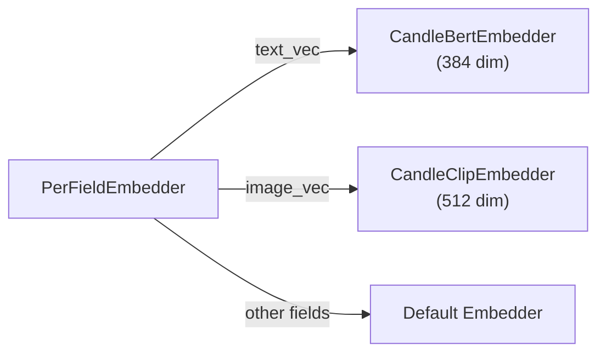

# Embeddings

Embeddings convert text (or images) into dense numeric vectors that capture semantic meaning. Two texts with similar meanings produce vectors that are close together in vector space, enabling similarity-based search.

## The Embedder Trait

All embedders implement the `Embedder` trait:

```rust
#[async_trait]
pub trait Embedder: Send + Sync + Debug {
    async fn embed(&self, input: &EmbedInput<'_>) -> Result<Vector>;
    async fn embed_batch(&self, inputs: &[EmbedInput<'_>]) -> Result<Vec<Vector>>;
    fn supported_input_types(&self) -> Vec<EmbedInputType>;
    fn name(&self) -> &str;
    fn as_any(&self) -> &dyn Any;
}
```

The `embed()` method returns a `Vector` (a struct wrapping `Vec<f32>`).

`EmbedInput` supports two modalities:

| Variant | Description |
| :--- | :--- |
| `EmbedInput::Text(&str)` | Text input |
| `EmbedInput::Bytes(&[u8], Option<&str>)` | Binary input with optional MIME type (for images) |

### Token-Level Embedders

Late-interaction models such as ColBERT turn an input into one vector per
token instead of one vector in total, and encode queries and documents
differently. Such an embedder also implements `TokenEmbedder` and returns
itself from `Embedder::as_token_embedder` (Issue #1349):

```rust
#[async_trait]
pub trait TokenEmbedder: Send + Sync + Debug {
    async fn embed_tokens(&self, inputs: &[EmbedInput<'_>], role: EmbedRole)
        -> Result<Vec<Vec<Vector>>>;
    fn token_dimension(&self) -> usize;
}

pub enum EmbedRole { Query, Document }
```

A [multi-vector field](schema_and_fields.md#multi-vector-fields) embeds text
only through this trait. An embedder without it (any single-vector model)
is rejected rather than silently producing a one-token document.

## Built-in Embedders

### CandleBertEmbedder

Runs a BERT model locally using Hugging Face Candle. No API key required.

**Feature flag:** `embeddings-candle`

```rust
use laurus::CandleBertEmbedder;

// Downloads model on first run (~80MB)
let embedder = CandleBertEmbedder::new(
    "sentence-transformers/all-MiniLM-L6-v2"  // model name
)?;
// Output: 384-dimensional vector
```

| Property | Value |
| :--- | :--- |
| Model | `sentence-transformers/all-MiniLM-L6-v2` |
| Dimensions | 384 |
| Runtime | Local (CPU) |
| First-run download | ~80 MB |

It encodes like sentence-transformers, and its vectors match
sentence-transformers' within 1e-6 per element for
`all-MiniLM-L6-v2` and `paraphrase-multilingual-MiniLM-L12-v2`:

- An input is truncated to the model's `max_seq_length` from
  `sentence_bert_config.json` (256 tokens for `all-MiniLM-L6-v2`, 128 for
  `paraphrase-multilingual-MiniLM-L12-v2`), special tokens included. A
  repository without that file falls back to the truncation length in
  `tokenizer.json`, then to the model's `max_position_embeddings`. The
  padding configured in `tokenizer.json` is ignored.
- The vector is the mean of the token vectors, L2-normalized. This is
  done for every model, also for one whose sentence-transformers pipeline
  does not normalize (such as `paraphrase-multilingual-MiniLM-L12-v2`) or
  pools differently.

`CandleBertEmbedder::with_options(model, CandleBertOptions::default().revision("<commit>"))`
pins the model to a commit.

> **Migration note (Issue #1340):** earlier versions passed the attention
> mask to the model as token type ids and padded every input to the
> `tokenizer.json` length, so their vectors were off (for
> `all-MiniLM-L6-v2`, a cosine of only 0.61–0.70 with sentence-transformers'
> on short texts). `candle_bert` vectors are now different, and long inputs
> keep up to `max_seq_length` tokens instead of 128 for `all-MiniLM-L6-v2`.
> Re-embed indexes built with `candle_bert`: otherwise new query vectors are
> compared with old document vectors.
>
> **Migration note (Issue #1355):** earlier versions cached downloaded
> models under `~/.cache/huggingface/models--*` instead of hf-hub's own
> default `~/.cache/huggingface/hub/models--*` (also ignoring
> `HF_HUB_CACHE`/`XDG_CACHE_HOME`). Models now download to hf-hub's
> default location, shared with the Python `huggingface_hub` library.
> Existing downloads under the old path are not reused and can be deleted.

### OpenAIEmbedder

Calls the OpenAI Embeddings API. Requires an API key.

**Feature flag:** `embeddings-openai`

```rust
use laurus::OpenAIEmbedder;

let embedder = OpenAIEmbedder::new(
    api_key,
    "text-embedding-3-small".to_string()
).await?;
// Output: 1536-dimensional vector
```

| Property | Value |
| :--- | :--- |
| Model | `text-embedding-3-small` (or any OpenAI model) |
| Dimensions | 1536 (for text-embedding-3-small) |
| Runtime | Remote API call |
| Requires | `OPENAI_API_KEY` environment variable |

### CandleClipEmbedder

Runs a CLIP model locally for multimodal (text + image) embeddings.

**Feature flag:** `embeddings-multimodal`

```rust
use laurus::CandleClipEmbedder;

let embedder = CandleClipEmbedder::new(
    "openai/clip-vit-base-patch32"
)?;
// Text or images → 512-dimensional vector
```

| Property | Value |
| :--- | :--- |
| Model | `openai/clip-vit-base-patch32` |
| Dimensions | 512 |
| Input types | Text AND images |
| Use case | Text-to-image search, image-to-image search |

> **Migration note (Issue #1355):** earlier versions cached downloaded
> models under `~/.cache/huggingface/models--*` instead of hf-hub's own
> default `~/.cache/huggingface/hub/models--*` (also ignoring
> `HF_HUB_CACHE`/`XDG_CACHE_HOME`). Models now download to hf-hub's
> default location, shared with the Python `huggingface_hub` library.
> Existing downloads under the old path are not reused and can be deleted.

### CandleColbertEmbedder

Runs a BERT-based ColBERT checkpoint locally and produces one vector per
token, for [late-interaction rescoring](search/vector_search.md#late-interaction-rescore)
over a multi-vector field. It is a token-level embedder only: `embed()`
returns an error.

**Feature flag:** `embeddings-candle`

```rust
use laurus::{CandleColbertEmbedder, CandleColbertOptions};

// Uses the checkpoint's own settings (artifact.metadata).
let embedder = CandleColbertEmbedder::new("colbert-ir/colbertv2.0")?;

// Pin the model commit and override the lengths.
let embedder = CandleColbertEmbedder::with_options(
    "answerdotai/answerai-colbert-small-v1",
    CandleColbertOptions::default()
        .revision("934fa8bb4ce2284f4c2baa232d81aca4d076fa5e")
        .doc_maxlen(300),
)?;
```

| Property | `colbert-ir/colbertv2.0` | `answerdotai/answerai-colbert-small-v1` |
| :--- | :--- | :--- |
| Token dimension | 128 | 96 |
| Query length (`query_maxlen`) | 32 | 32 |
| Document length (`doc_maxlen`) | 180 | 300 |
| License | MIT | Apache-2.0 |
| Runtime | Local (CPU) | Local (CPU) |

It encodes like colbert-ai, the reference implementation:

```text
query:    [CLS] [unused0] w1 … wn [SEP] [MASK] … [MASK]   exactly query_maxlen tokens
document: [CLS] [unused1] w1 … wn [SEP]                   at most doc_maxlen tokens
```

- The query's `[MASK]` padding is not attended to, but its vectors are kept:
  they expand the query.
- Document vectors of punctuation tokens are dropped.
- Every vector goes through the checkpoint's `linear` projection and is
  L2-normalized.

The lengths, the markers and these switches come from the checkpoint's
`artifact.metadata` (colbert-ai's defaults, 32 and 220, apply when the file
is missing); `CandleColbertOptions` overrides the lengths. For both
checkpoints above, its vectors match colbert-ai's within 1e-6 per element.

Inference runs on the CPU in a blocking task, in batches of up to 32
inputs. As a guide, on an Apple M4 one query takes about 55 ms with
`colbertv2.0` and 18 ms with `answerai-colbert-small-v1`, and a document of
about 110 tokens about 135 ms and 45 ms.

Pin `revision` to a commit: the write-ahead log keeps the text of
documents that are not committed yet and embeds it again on recovery, and a
changed model would produce different vectors. Only BERT-based checkpoints
are supported (ModernBERT-based ones such as `lightonai/GTE-ModernColBERT-v1`
are not).

### PrecomputedEmbedder

Use pre-computed vectors directly without any embedding computation. Useful when vectors are generated externally.

```rust
use laurus::PrecomputedEmbedder;

let embedder = PrecomputedEmbedder::new();  // no parameters needed
```

When using `PrecomputedEmbedder`, you provide vectors directly in documents instead of text for embedding:

```rust
let doc = Document::builder()
    .add_vector("embedding", vec![0.1, 0.2, 0.3, ...])
    .build();
```

## PerFieldEmbedder

`PerFieldEmbedder` routes embedding requests to field-specific embedders:



```rust
use std::sync::Arc;
use laurus::PerFieldEmbedder;

let bert = Arc::new(CandleBertEmbedder::new("...")?);
let clip = Arc::new(CandleClipEmbedder::new("...")?);


let per_field = PerFieldEmbedder::new(bert.clone());
per_field.add_embedder("text_vec", bert.clone());
per_field.add_embedder("image_vec", clip.clone());

let engine = Engine::builder(storage, schema)
    .embedder(Arc::new(per_field))
    .build()
    .await?;
```

This is especially useful when:

- Different vector fields need different models (e.g., BERT for text, CLIP for images)
- Different fields have different vector dimensions
- You want to mix local and remote embedders

## How Embeddings Are Used

### At Index Time

When you add a text value to a vector field, the engine automatically embeds it:

```rust
let doc = Document::builder()
    .add_text("text_vec", "Rust is a systems programming language")
    .build();
engine.add_document("doc-1", doc).await?;
// The embedder converts the text to a vector before indexing
```

A multi-vector field whose embedder is a token-level one takes text the
same way: the text is embedded into one vector per token, as a document.

### At Search Time

When you search with text, the engine embeds the query text as well:

```rust
// Builder API
let request = VectorSearchRequestBuilder::new()
    .add_text("text_vec", "systems programming")
    .build();

// Query DSL
let request = vector_parser.parse(r#"text_vec:"systems programming""#).await?;
```

Both approaches embed the query text using the same embedder that was used at index time, ensuring consistent vector spaces.

A late-interaction rescore takes its query as text too
(`RescoreOptions::late_interaction_text`); the multi-vector field's
token-level embedder embeds it as a query.

## Feature Flags Summary

Each embedder requires a specific feature flag to be enabled in `Cargo.toml`:

| Embedder | Feature Flag | Dependencies |
| :--- | :--- | :--- |
| `CandleBertEmbedder` | `embeddings-candle` | candle-core, candle-nn, candle-transformers, hf-hub, tokenizers |
| `CandleColbertEmbedder` | `embeddings-candle` | same as `CandleBertEmbedder` |
| `OpenAIEmbedder` | `embeddings-openai` | reqwest |
| `CandleClipEmbedder` | `embeddings-multimodal` | image + embeddings-candle |
| `PrecomputedEmbedder` | *(none -- always available)* | -- |

The `embeddings-all` feature enables all embedding features at once. See [Feature Flags](../development/feature_flags.md) for details.

## Choosing an Embedder

| Scenario | Recommended Embedder |
| :--- | :--- |
| Quick prototyping, offline use | `CandleBertEmbedder` |
| Production with high accuracy | `OpenAIEmbedder` |
| Text + image search | `CandleClipEmbedder` |
| Late-interaction rescoring (multi-vector fields) | `CandleColbertEmbedder` |
| Pre-computed vectors from external pipeline | `PrecomputedEmbedder` |
| Multiple models per field | `PerFieldEmbedder` wrapping others |
