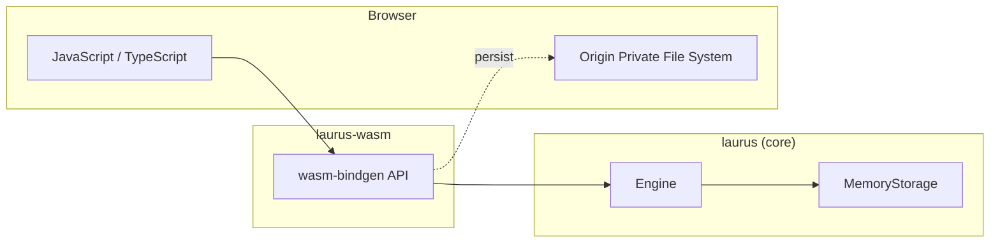

# WASM Binding Overview

The `laurus-wasm` package provides WebAssembly bindings for the
Laurus search engine. It enables lexical, vector, and hybrid search
directly in browsers and edge runtimes (Cloudflare Workers,
Vercel Edge Functions, Deno Deploy) without a server.

## Features

- **Lexical Search** -- Full-text search powered by an inverted
  index with BM25 scoring
- **Vector Search** -- Approximate nearest neighbor (ANN) search
  using Flat, HNSW, or IVF indexes
- **Hybrid Search** -- Combine lexical and vector results with
  fusion algorithms (RRF, WeightedSum)
- **Late-Interaction Rescore** -- Reorder the top results by
  ColBERT-style MaxSim over per-token vectors in a multi-vector field
- **Rich Query DSL** -- Term, Phrase, Fuzzy, Wildcard,
  NumericRange, Geo, Boolean, Span queries
- **Text Analysis** -- Tokenizers, filters, and synonym expansion
- **In-memory Storage** -- Fast ephemeral indexes
- **OPFS Persistence** -- Indexes survive page reloads via the
  Origin Private File System
- **TypeScript Types** -- Auto-generated `.d.ts` type definitions
- **Async API** -- All I/O operations return Promises

## Architecture



## Embedding Strategies

On native platforms Laurus supports several built-in embedders (Candle BERT,
Candle CLIP, Candle ColBERT, OpenAI API) that the engine can invoke
automatically when a document is indexed or when
`searchVectorText("field", "query text")` is called. These native embedders
cannot run inside `wasm32-unknown-unknown` and are therefore disabled in the
WASM build:

| Embedder         | Dependency        | Why it cannot run in WASM                                   |
| ---------------- | ----------------- | ----------------------------------------------------------- |
| `candle_bert`    | candle (GPU/SIMD) | Requires native SIMD intrinsics and file system for models  |
| `candle_clip`    | candle            | Same as above                                               |
| `candle_colbert` | candle            | Same as above                                               |
| `openai`         | reqwest (HTTP)    | Requires a full async HTTP client (tokio + TLS)             |

(They are excluded from the WASM build via the `embeddings-candle` /
`embeddings-openai` feature flags, which depend on the `native` feature that
is disabled for `wasm32-unknown-unknown`.)

`laurus-wasm` exposes three `addEmbedder` types instead:

- **`"precomputed"`** — The caller supplies vectors directly via `putDocument()`
  and `searchVector()`. The engine performs no embedding.
- **`"callback"`** — Register a JavaScript callback
  `embed: (text) => Promise<number[]>` and the engine will invoke it during
  ingestion and from `searchVectorText()`. This enables in-engine
  auto-embedding using Transformers.js (or any other in-browser embedding
  library) so callers can use the same `searchVectorText("field", "query text")`
  pattern as on native platforms.
- **`"token_callback"`** — Register a JavaScript callback
  `embed: (text, role) => number[][] | Promise<number[][]>` plus its token
  vector `dimension` for a multi-vector field. The engine invokes it for text
  values of the field and for a rescore's query text, in place of the native
  `candle_colbert` embedder. See
  [Option C](#option-c--token-callback-embedder-late-interaction-rescore).

### Option A — Precomputed vectors

Compute embeddings on the **JavaScript side** and pass precomputed vectors
to `putDocument()` and `searchVector()`:

```javascript
// Using Transformers.js (all-MiniLM-L6-v2, 384-dim)
import { pipeline } from '@huggingface/transformers';

const embedder = await pipeline('feature-extraction', 'Xenova/all-MiniLM-L6-v2');

async function embed(text) {
  const output = await embedder(text, { pooling: 'mean', normalize: true });
  return Array.from(output.data);
}

// Index with precomputed embedding
const vec = await embed("Introduction to Rust");
await index.putDocument("doc1", { title: "Introduction to Rust", embedding: vec });
await index.commit();

// Search with precomputed query embedding
const queryVec = await embed("safe systems programming");
const results = await index.searchVector("embedding", queryVec);
```

This approach gives you real semantic search in the browser using the same
sentence-transformer models available on native platforms, with the embedding
computation handled by Transformers.js (ONNX Runtime Web) instead of candle.

### Option B — Callback embedder

Register the same Transformers.js pipeline as a `"callback"` embedder so that
the engine can call it automatically. After registration, ingestion and
`searchVectorText()` work transparently without the caller managing vectors:

```javascript
import { pipeline } from '@huggingface/transformers';

const extractor = await pipeline('feature-extraction', 'Xenova/all-MiniLM-L6-v2');

schema.addEmbedder("transformers", {
  type: "callback",
  embed: async (text) => {
    const output = await extractor(text, { pooling: 'mean', normalize: true });
    return Array.from(output.data);
  },
});
schema.addHnswField("embedding", 384, "cosine", undefined, undefined, undefined, "transformers");
const index = await Index.create(schema);

await index.putDocument("doc1", { title: "Introduction to Rust" });
await index.commit();

const results = await index.searchVectorText("embedding", "safe systems programming");
```

Compared to Option A, the callback approach lets the engine cache embeddings
during ingestion and avoids duplicating embedding code between writers and
readers. The trade-off is that every `commit()` waits for the JS callback to
resolve, so heavy bulk ingestion may benefit from precomputing vectors.

### Option C — Token callback embedder (late-interaction rescore)

A late-interaction model such as ColBERT represents a text as one vector per
token. Keep those token vectors in a multi-vector field and use them to
rescore the top results of any search — lexical, vector or hybrid — by MaxSim
(Issue #1351); see
[Late-Interaction Rescore](concepts/search/vector_search.md#late-interaction-rescore).

Register the model as a `"token_callback"` embedder. The callback receives the
text and a `role` (`"query"` or `"document"`, since late-interaction models
encode the two differently) and returns one `dimension`-long vector per token,
as a `number[][]` or a Promise of one:

```javascript
// myColbert wraps a ColBERT model that runs in the browser (e.g. via ONNX Runtime Web).
schema.addEmbedder("colbert", {
  type: "token_callback",
  embed: async (text, role) => myColbert.encode(text, role), // number[][]
  dimension: 128,
});
schema.addTextField("body");
schema.addMultiVectorField("body_colbert", 128, "cosine", "colbert");
const index = await Index.create(schema);

// The callback embeds the text value with role "document".
const body = "Lifetimes let the Rust compiler check that references stay valid";
await index.putDocument("doc1", { body, body_colbert: body });
await index.commit();

// Rescore the top lexical hits; the callback embeds the query text with role "query".
const results = await index.search("body:rust", 10, 0, undefined, {
  field: "body_colbert",
  text: "how do lifetimes work",
});
```

Without an embedder, pass precomputed token vectors instead: nested arrays
(`body_colbert: [[0.1, ...], [0.3, ...]]`) when indexing, and
`{ field: "body_colbert", vectors: [[...], ...] }` when searching. The token
vectors are never returned by `getDocuments()` or in search results. Besides
`search()`, `searchVector()` and `searchVectorText()` take the same trailing
`rescore` argument; see the
[API Reference](laurus-wasm/api_reference.md#late-interaction-rescore).

## When to Use laurus-wasm vs laurus-nodejs

| Criterion   | `laurus-wasm`              | `laurus-nodejs`               |
| ----------- | -------------------------- | ----------------------------- |
| Environment | Browser, Edge Runtime      | Node.js server                |
| Performance | Good (single-threaded)     | Best (native, multi-threaded) |
| Storage     | In-memory + OPFS           | In-memory + File system       |
| Embedding   | Precomputed + JS callback  | Candle, OpenAI, Precomputed   |
| Package     | `npm install laurus-wasm`  | `npm install laurus-nodejs`   |
| Binary size | ~5-10 MB (WASM)            | Platform-native               |
